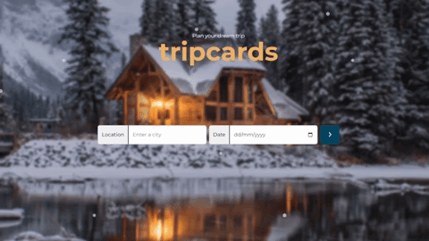

# tripscards

  

<!--  -->

## Table of Contents

* [Description](#description)
* [Questtions I Encountered](#questions-i-encountered)
* [Technologies Used](#technologies-used)

## Description

Extracting data sources from multiple APIs, this is a dynamic travel weather planning application that helps people plan trips by generating weather forecasts for the places they’re visiting.

After finishing Udacity's [Frontend Web Developer Nanodegree](https://graduation.udacity.com/api/graduation/certificate/PDFJSY3R/download), this project aimed to give me the opportunity to put all of the skills I have learned into one project to build my own custom travel app called **'tripcards'**. 

I will be targeting the DOM, working with objects, and retrieving data from 3 APIs in which one of those is reliant on another to work. Also, this is all going to be done in a Webpack environment, using an express server, and wrapped up with service workers.

## Questions I Encountered

The following are just some of the questions that I've experienced along the way:

- What’s the ideal workflow?
- How many files do I need?
- How do I convert one project into another?
- Should I redo the HTML/CSS first or go straight to the javascript?
- How many JavaScript functions do I need?
- Should my function be this many lines of code?
- Is readability or performance more important?

## Technologies Used
- HTML
- SCSS
- JavaScript
- Node.js
- Express.js
- Web API (MeaningCloud Sentiment Analysis API)
- Webpack
- Jest (Testing)
- Service Worker (External script)

## Author
[Jym Bocala](https://github.com/jymbocala)